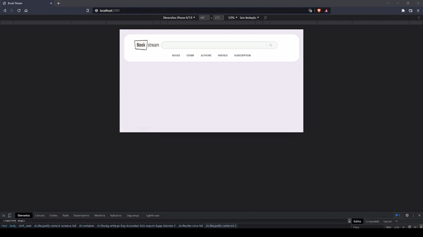

<h1 align="left">
    <a href="https://pt-br.reactjs.org/">🔗 Book Finder</a>
</h1>
<p align="left">🚀 Web apllication developed using Next JS + TypeScript + TailwindCSS + ReactQuery technologies to enable book search using <i>Google Books API</i>.</p>

Running
=================

#### 🧭 Running in a browser (Frontend)

```bash

# Clone this repository
$ git clone git@github.com:wallacefreitas/book-finder-app.git

# Access the folder project in your terminal/cmd
$ cd book-finder-app

# Install the dependencies
$ npm install

# Run  the application in development mode
$ npm run start

# The application will open in port:3000 - go to http://localhost:3000

```
---

## 🛠 Technologies

The following tools were used in building the project:

#### **Website**  ([Next JS](https://nextjs.org/)  +  [TypeScript](https://www.typescriptlang.org/))

-   **[React Query](https://tanstack.com/query/v4/?from=reactQueryV3&original=https://react-query-v3.tanstack.com/)**
-   **[TailwindCSS](https://tailwindcss.com/docs/guides/create-react-app)**

> See the file  [package.json](package.json)

---

## 📷 Screenshots



---

## 📝 License

This project is under license [MIT](./LICENSE).

Made by Wallace de Freitas 👋🏽